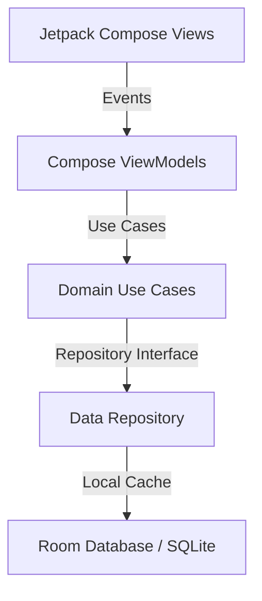

# JungianTarotApp (Android): Subconscious Archetype Projection Engine

## 📖 Abstract

**JungianTarotApp** is a native Android application written in Kotlin and Jetpack Compose. The application translates Carl Jung's theory of analytical psychology, archetypal projections, and synchronicity into an interactive esoteric drawing simulator. It provides the user with visual tarot spreads and queries an internal model or API for deep psychological interpretation.

This repository forms the parent model of the [iOS Swift port](https://github.com/DOMINUSBABEL/JungianTarotApp-iOS).

---

## 🏛️ Architectural Principles

The application is built strictly under **Clean Architecture** principles to isolate business logic from framework dependencies.

### Project Structure:
- **`presentation`**: Houses the Jetpack Compose components, custom drawing Canvas, and ViewModels managing UI states and esoteric animations.
- **`domain`**: Contains the core business rules, entity models (Tarot card definitions, Archetype metadata), and Use Cases governing draw mechanics.
- **`data`**: Implements repositories, local Room SQLite caches, and API remote network layers.

---

## 🚀 Getting Started

### Prerequisites:
- **Android Studio Koala / Ladybug** or newer.
- **Android SDK** (API level 33+).
- **Gradle** (v8.0+).

### Running:
1. Open the project in Android Studio.
2. Gradle will sync dependencies automatically.
3. Configure `local.properties` if you require integration with remote Gemini parsing endpoints.
4. Press **Run** to launch the application on an emulator or physical device.
